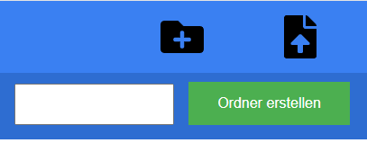
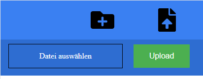

# Storagable

Storagable (Storage + accessable) is an Node-Application which enables you to access all of your hard disc through a Web application e.g. on your phone.

| |
|:--:|
| Home |


You are also able to upload files and photos from your every device possible and create folders through the Application.

| |
|:--:|
| Ordner erstellen |

| |
|:--:|
| Datei hochladen |

This enables you to quickly backup your photos to your hard desk without having to plug your phone.

If you want to you can enable FTP_Backup which leads to your data beeing saved at 
two places. It will enable storagable to upload your data to your local FTP Server.

## Technology

Storagable uses an React Front-End with an Express Back-End. The Front-End is build with Webpack and served from the Express-Server.

## Settup

Bevor starting the application create a `config.js` inside of the `server` folder and also inside of the `src` folder. Both come with templates and have following structure

If you dont want to backup your data at an FTP-Server disable FTP_Backup and ignore the other FTP_ Parameters. If not fill in your auth-data.

The FTP_BASE_PATH is the starting point of the ftp-server for our backup. This allows you to set an sub-directory of your ftp-server only for backups of this application

SHOW_CONFIG_FILES -> If Config-Files with Point at the beginning of the file-name should be shown

`server/config.js`

```
const PATH_TO_DIR = "../../usb/"
const FTP_Backup = true
const FTP_HOST = ""
const FTP_USER = ""
const FTP_PASSWORD = ""
const FTP_BASE_PATH = ""
const SHOW_CONFIG_FILES = false

module.exports =  {
    PATH_TO_DIR,
    FTP_Backup,
    FTP_HOST,
    FTP_USER,
    FTP_PASSWORD,
    FTP_BASE_PATH,
    SHOW_CONFIG_FILES
}
```

ALLOW_HOME_UPLOAD is an Boolean if an upload on the highest path should be possible

`src/config.js`

```
const IP_ADRESS = "IP_ADRESS"
const PORT = ":8000"
const HTTP_METHOD = "http://"
const FULL_ROUTE = HTTP_METHOD + IP_ADRESS + PORT
const ALLOW_HOME_UPLOAD = false

export {
    IP_ADRESS,
    PORT,
    HTTP_METHOD,
    FULL_ROUTE,
    ALLOW_HOME_UPLOAD
}
```

## Run

If this is your first time running this project make sure to create the config files above. Next run `npm install` to install all dependencies (If you dont have node and stuff installed use tutorials from the internet to do so)

The Command `npm run build` puts all JS/HTML/CSS Files together and creates a new build which going to be served from the Backend. To start the Server run `node server.js` which will start it on localhost:8000

If you want to develop changes inside of the UI run `npm start` which will update on changes inside of the code and enable you to quickly see your changes.


## API-Endpoints

GET `/options`

Parameter:

?path="PATH_TO_FOLDER"

```
{
files: [1.pdf],
folders: [Private],
previousPath: "Path user came from"
currentPath: "Path the navigation at currently"

}
```
___

POST `/upload`

upload files from post body to folder from path

Query-Parameter:

path="PATH_TO_FOLDER

___


POST `/folder`

creates a new folder on given path

Query-Parameter:

path=PATH_TO_DOR
